

<h3>Financial-crime home task</h3>
<h1>Auditing our fraud performance, and building a net for what comes next</h1>
<strong>Alvaro Nieto</strong>

alvaronietosilva_1994@hotmail.com

Analysis of 688,651 transactions across 8,021 users
Written report plus an interactive tool, FraudLens

## Executive summary

I was handed one file: transaction logs with user demographics and a confirmed-fraud tag. I spent my time on two things. First, answering the four business questions with numbers I can defend. Second, turning the patterns I found into a tool the FC squad could point at any dataset, not just this one.

Five things I would want the FC squad to walk away with:

- **Our real conversion rate is closer to 76% than 78%.** Marketing's number counts anyone who verified and spent once. The moment I ask for a funded account that verified *and* actually spends, I land on 76.5%, and it keeps falling if I ask for sustained activity. The 78% is not wrong, it just measures activation rather than an economically useful customer.

- **The United Kingdom is where the risk actually sits.** It carries 13,088 of the 14,543 confirmed fraud transactions, a 3.4% fraud rate, and 6.9% of its users touched by fraud. On every measure that costs money, it leads.

- **The scariest-looking country is a mirage.** Germany tops the fraud-*rate* table at 5.6%, which almost sent me down the wrong road. All 508 of those transactions belong to a single account. Country rates lie when one actor is loud enough.

- **Passing KYC stops nothing on its own.** 260 of our 299 fraud accounts cleared identity checks. They don't look exotic; they look narrow and domestic, and they move money in through top-ups and straight out through ATMs.

- **The five accounts I would put on the Head of Risk's desk are not the five biggest thieves.** The single largest loss, £610k, comes from an account that never passed KYC, so our existing gate already flags that profile. I ranked instead by who beat our controls and stayed operational.

The interactive tool, **FraudLens**, packages the detection logic behind these findings so an analyst can load a CSV and see the same picture in seconds. It runs entirely in the browser, so no transaction data has to leave the machine.

## Data and the assumptions I made

The file holds 688,651 transactions for 8,021 users. Each row has a user id, a transaction type, an amount, a currency, the merchant country, the user's KYC status, birth year, country of residence, and a boolean fraud flag. There are no timestamps anywhere, which shaped several decisions below.

A few things I had to settle before any number could be trusted, all kept in one module so every script and the app agree:

- **Currency.** Amounts are integer minor units (pence, cents), and the file mixes 29 currencies. I convert everything to GBP with a fixed rate table covering the 14 currencies that make up the vast majority of volume. The other 15, including a handful of crypto rows whose amounts are not minor units at all, I leave unconverted and count separately rather than let a bad multiplication poison the totals. That is 6,212 rows, 0.9% of the file.

- **Merchant country is messy.** Thirty percent of the field is empty, and that emptiness is structural: top-ups, peer-to-peer and bank transfers have no merchant, so I never impute them. The codes that do exist are a mix of ISO3, two-letter US state and Canadian province codes ("CA" is California here, not Canada), and URL-encoded free text with the country tucked on the end. I wrote one parser for all of it; it fails on 0.32% of non-empty values, which I treat as unknown.

- **Age.** With no timestamps I can't compute a real age, so I anchor to 2020 and report age as 2020 minus birth year. Every age figure carries that assumption.

- **"Spend"** means any transaction that isn't a top-up: card payments, ATM withdrawals, peer-to-peer and bank transfers.

Two quality notes worth stating plainly. There are 12,023 zero-value rows and 207,743 exact duplicate rows. Without a transaction id or timestamp I can't tell a duplicate apart from a customer legitimately buying the same coffee twice, so I left them in and flag the caveat rather than guess. And the file only contains users who transacted at least once. Every rate I quote is conditional on that, which matters most for the conversion question.

The baseline the rest of the report sits against: 2.11% of transactions are fraud, and 3.73% of users (299 of 8,021) have at least one fraud transaction.

## Brief 1 — What is our conversion rate, really?

Marketing quotes about 78%. Before arguing with it I wanted to know what definition produces that number, so I rebuilt the funnel at the user level and tried the obvious candidates.

The match is almost exact. If "converted" means *passed KYC and spent at least once*, I get 77.9%. That is the 78%. The other candidates bracket it: 96.8% of users ever top up, 82.9% ever spend, 87.1% pass KYC.

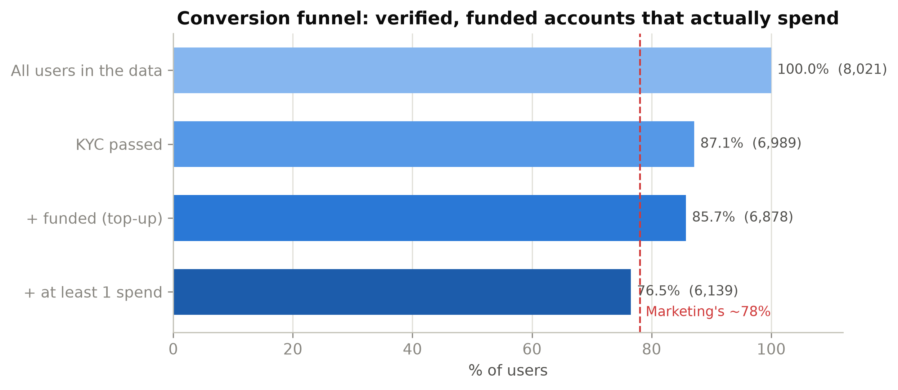

Every added condition removes a slice of users. Verified, funded and actually spending lands at 76.5%.

My problem with the 78% is not the arithmetic, it's what it rewards. An account that verifies and makes one payment is *activated*, but it isn't yet a customer worth the acquisition cost. So I tightened the definition to something closer to sustainable economic behaviour: **passed KYC, funded the account with a top-up, and made at least one real spend.** That gives **76.5%**. Close to Marketing, but built on a floor of genuine usage rather than a single tap.

The gap widens as soon as I ask for more than one transaction. Requiring a few spends, and dropping the accounts that turned out to be fraudulent, the rate slides from 73% at one spend to 61% at five and 54% at ten.

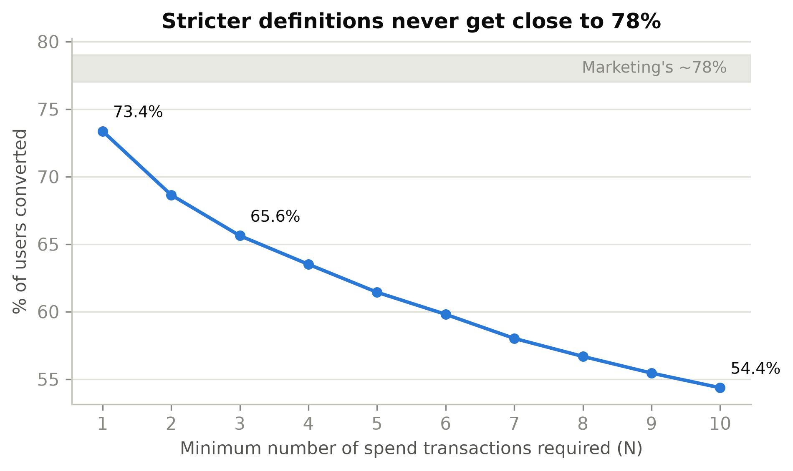

Ask for sustained activity and the number never returns to 78%. The band marks Marketing's figure.

I deliberately did not pick "five spends" as the headline. There is no business reason three or five is the right cut, so choosing one would be a number dressed up as a fact. The honest headline is 76.5% for a funded, verified, spending account, with the curve shown so the reader sees how fast quality erodes when we demand more.

What I would tell Marketing: you are measuring activation and reporting it as conversion. Both are useful, but they answer different questions. If the goal is to forecast revenue or judge acquisition quality, the funded-and-spending number is the one to track. One caveat I would not hide: this file only contains users who already transacted, so the true funnel from sign-up is lower than either figure. I can't measure that part from here.

## Brief 2A — The single highest-risk country

I need to separate two questions the brief rightly keeps apart: *where do most attacks happen* (volume) and *where is a given transaction most likely to be fraud* (probability). They have different answers, and conflating them is the trap.

To stop tiny countries winning on noise, I only let a country compete on rate if it has at least 500 transactions and 30 users. Twenty-two of 56 residence countries clear that bar; the rest I keep in a separate list.

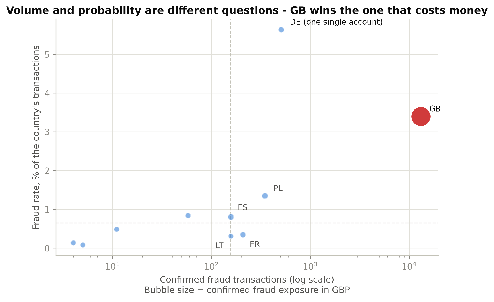

Volume on the x-axis, fraud rate on the y-axis, bubble size is GBP exposure. GB sits far right; Germany sits high but light.

My answer is the **United Kingdom**, and I'll say why in the terms that matter for a bank: expected loss is roughly volume times probability times ticket size, and GB leads on all three. It holds 13,088 fraud transactions, 90% of every fraud transaction in the file. Its fraud rate is 3.4%, with a tight confidence interval because the sample is huge. 6.9% of GB users were hit. Its confirmed exposure is £3.79M, against £94k for the next country. There is no reading of "risk" under which GB is not the answer.

Germany is the more interesting story, and it nearly fooled me. On the rate table it comes first at 5.6%, higher than GB. My first instinct was to flag it as an emerging hotspot. Then I looked at the accounts behind it: all 508 German fraud transactions belong to *one* user, who passed KYC and whose every transaction is fraud. At the user level Germany's fraud rate is 0.68%, not 5.6%. That one account also owns 89% of the Germany-to-Cyprus card corridor. So Germany isn't a country problem, it's a single-account problem wearing a country's clothing.

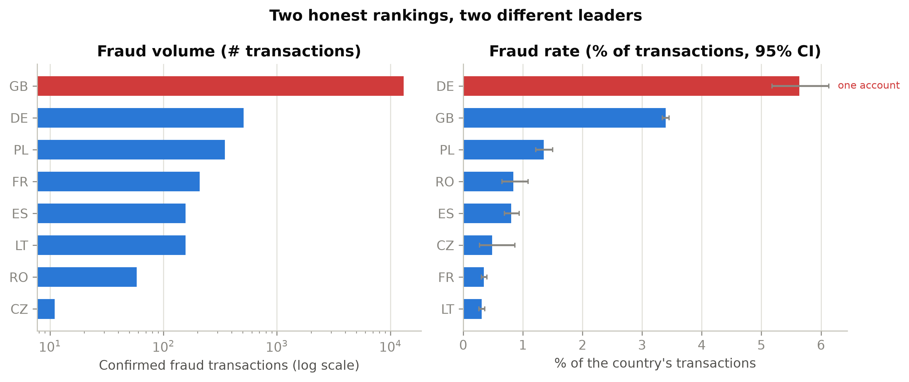

The two rankings disagree on the leader. Germany's rate bar is one account; the note says so.

The merchant-country view broadly agrees with the residence view (GB leads there too, 6,631 fraud transactions), with one oddity worth a follow-up: Gibraltar shows a 15.7% fraud rate on 880 transactions. That is small enough to sit in the watch list rather than the headline, but large enough that I would not ignore it.

The operational takeaway splits by cause. GB needs capacity and better rules, because its risk is broad and systemic. Germany needs an investigator to open one case, because its risk is one account. Treating them the same would waste effort on both.

## Brief 2B — The fraudsters who pass KYC

The premise of this brief turned out to be the finding. 260 of our 299 fraud accounts passed KYC. The remaining 39 sit in failed or pending, and not one fraud account has a KYC status of "none", which suggests the product already gates unverified users out of the risky flows. Identity checks are doing something. They are just not enough.

One structural fact shaped everything here: every fraud account has 100% of its history tagged as fraud. These are not ordinary customers who had one bad transaction, they are dedicated fraud accounts. That means I can't study "how their behaviour changed", because there is no clean period to compare against. What I can do is compare the 260 fraud accounts against the 6,729 clean accounts that also passed KYC, on behaviour alone, and never on the fraud tag itself.

Where the two groups genuinely differ (ratios are fraud mean over clean mean, with bootstrap confidence intervals):

- **ATM share of activity: 15.3% versus 6.1%** — two and a half times higher.
- **Median transaction: £168 versus £39** — four times larger.
- **Round amounts: 17.6% versus 9.3%** — money moved in tidy figures.
- **Younger: 32 versus 37** on average.

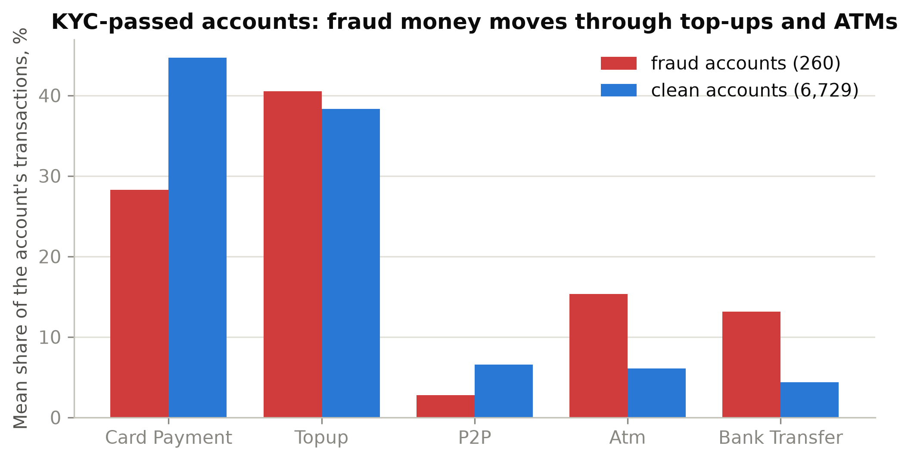

Fraud money leans on top-ups in and ATM withdrawals out, and away from ordinary card spend.

The more useful result was what did *not* separate the groups. I went in expecting the textbook signatures: bursts of tiny card payments (card testing) and transactions scattered across many countries. Neither holds here. Clean users actually make *more* sub-£1 card payments and touch *more* merchant countries than the fraud accounts do. Our fraudsters are narrow and domestic; only 17% of their merchant activity is foreign, against 64% for clean users. If I had trusted the textbook I would have built the wrong rules.

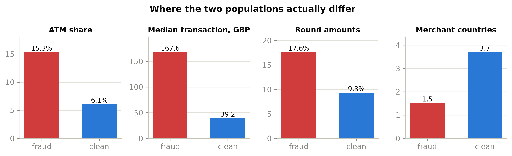

The four measures that actually pull the groups apart.

Grouping the 260 accounts by simple rules, three shapes cover three quarters of them:

- **The Mule (78 accounts, 30%).** Money in via top-up, out via ATM, three or more withdrawals. High ATM share, lots of round numbers. This is cash extraction.
- **The Grinder (63 accounts, 24%).** High-volume accounts, 30-plus transactions, running steadily rather than in a burst.
- **The Hit-and-Run (53 accounts, 20%).** Ten transactions or fewer, in and gone.

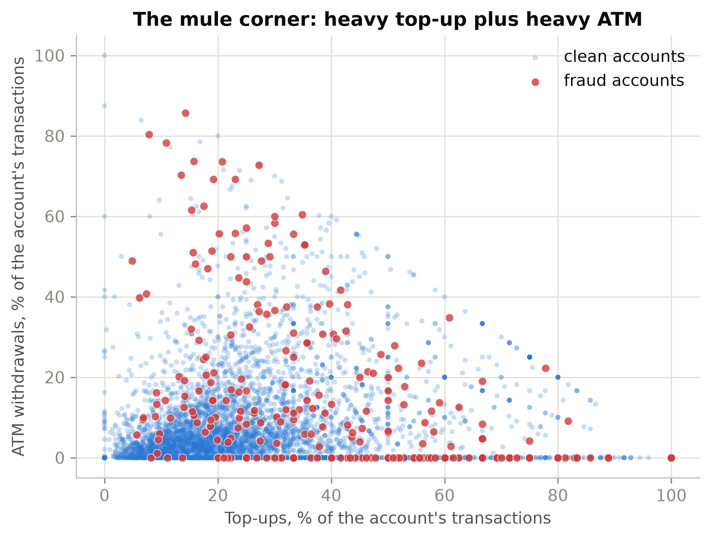

Fraud accounts (red) cluster where both top-up and ATM shares are high.

The controls I would put in, given we have no timestamps to build true velocity rules on: cap ATM withdrawals for young accounts and step them up when their ATM share climbs; add a count-based check on top-up-to-ATM chains that move in round numbers; and review the first few transactions of any account that goes heavy immediately, which is the hit-and-run tell. None of these depend on the fraud label, so they generalise to accounts we haven't caught yet.

## Bonus — The five I would hand over first

Ranking by total loss is the obvious move and I think it's the wrong one. It crowns whoever happened to push one large transaction, and it ignores whether the account beat our controls or is still capable of doing damage. So I scored each of the 299 fraud accounts on five things, each turned into a percentile within the group: financial impact (loss in GBP, with single transactions capped so one outlier can't dominate), intensity (how much of their activity is fraud, and how much of it there is), sophistication (did they pass KYC, did they move money out through cash or transfers), operational breadth (currencies, countries, transaction types), and persistence.

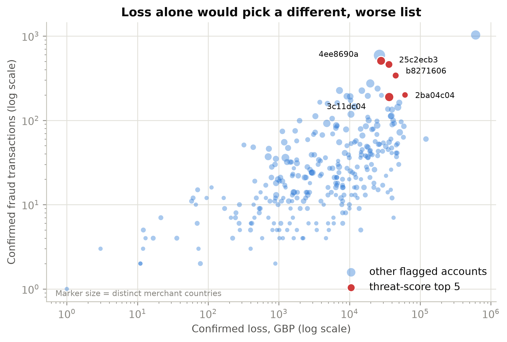

Loss alone would pick the account far to the right. My five (red) trade raw loss for intensity and reach.

To be sure the list wasn't an artefact of my weights, I perturbed every weight and checked who stayed in the top five. There is a clean break after the fifth account: the top five hold their place across 78% or more of the perturbations, the sixth only 41%.

| # | Account | Loss (GBP) | Fraud tx | KYC | Why it made the cut |
|---|---------|-----------|----------|-----|---------------------|
| 1 | b8271606 | £45k | 340 | passed | High intensity across four currencies; beat KYC |
| 2 | 25c2ecb3 | £36k | 460 | passed | Sustained high-volume operator, passed KYC |
| 3 | 2ba04c04 | £61k | 200 | passed | Larger loss with real breadth |
| 4 | 3c11dc04 | £36k | 189 | passed | Spread across nine merchant countries |
| 5 | 4ee8690a | £28k | 508 | passed | The German single-account corridor operator from Brief 2A |

Every one of the five passed KYC. That is the point of this list: they are the accounts that defeated the control the previous brief is about.

The account with the biggest loss, £610k across 1,029 transactions, is deliberately *not* here. Its KYC status is pending, meaning it never cleared identity checks, so our existing gate already catches that profile. On my score it lands at rank 27. I would still investigate it, but as a caught-by-the-gate case, not as a priority target that slipped through.

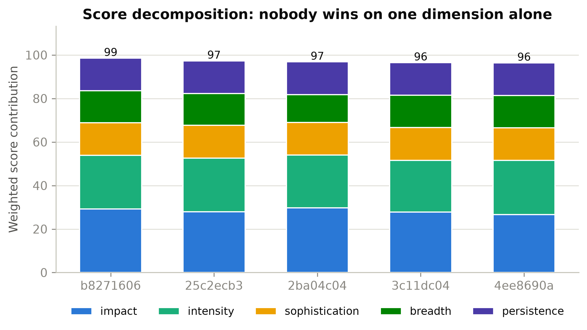

No account wins on one dimension; each is dangerous across several.

One honesty note on framing. The fraud tag marks a transaction, not a person. An account whose entire history is fraud is most likely a dedicated mule; an account with a small fraud share could be a compromised genuine customer. With this schema I can't fully tell them apart, and I would want production signals to separate perpetrators from victims before any account here is treated as guilty.

## FraudLens — the net, not just the audit

The four briefs answer the questions once. The squad's real problem is doing this again next month, on the next dataset, without re-running a notebook. So I built **FraudLens**: a single-page tool where an analyst drops in a transactions CSV and gets the same view I worked from. It runs entirely in the browser, which matters for financial data — nothing is uploaded anywhere.

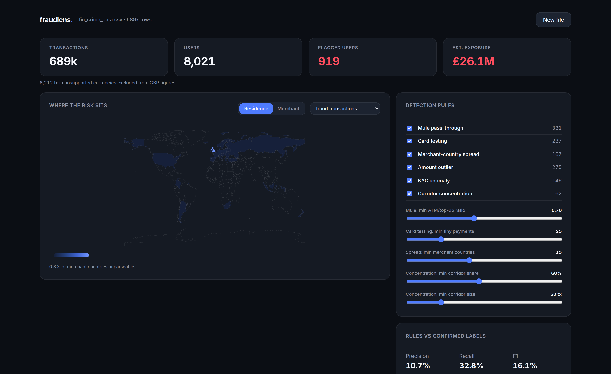

Upload a CSV, map the columns, and the dashboard builds itself: exposure, a risk map, and live-tunable rules.

It maps any file's columns onto the fields it needs and degrades gracefully when optional ones are missing. The detection is the same logic from the briefs, turned into six explainable rules, and every flag comes with the numbers behind it rather than a black-box score. Each threshold is a slider, so an analyst can tighten or loosen a rule and watch the population re-flag instantly.

Under the map I added the parts an analyst reaches for next. A corridor list ranks the residence-to-merchant routes the money actually takes, and it surfaces the Germany-to-Cyprus lane from Brief 2A without being told to look. A money-in versus cash-out plot puts the mule signature on screen: accounts that fund and withdraw in step, with no real card spend, sit on the diagonal. A coverage read-out ties detection back to pounds, so the analyst sees that the flagged population is a small share of users but a large share of the exposure. Clicking any account, on the leaderboard or in a country, opens its full transaction history and a one-glance profile of where and how it operates, and lets the analyst export that account's transactions as a CSV to hand to an investigator.

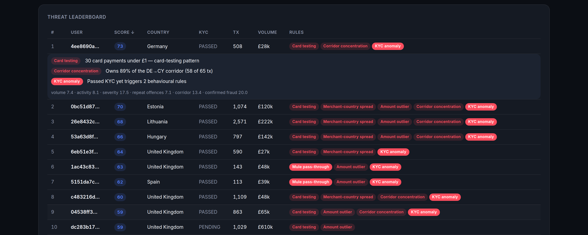

The German corridor account surfaces at the top with its reasons spelled out; the £610k pending account sits far lower, as it should.

When the file includes a fraud label, FraudLens grades itself against it. On this dataset the rules run at about 11% precision and 33% recall at the user level. I want to be plain about that: this is a transparent first net, not a model. It is meant to narrow 8,021 users down to a few hundred an analyst can actually work, with a reason attached to each, and to be tuned per programme. It is deliberately a different tool from the Bonus ranking above, which is tuned to this file's labels; FraudLens has to work on files that have no labels at all.

## Limitations and what I would do next

I would rather be clear about the edges of this than oversell it.

- **No timestamps.** This is the biggest gap. Velocity, time-of-day and account-age rules are where fraud detection earns its keep, and I couldn't build any of them. Everything time-like here is a proxy.
- **Static FX and an assumed year.** Both are simplifications I chose for consistency over precision. They move exposure figures by single-digit percentages, not orders of magnitude, but they are assumptions.
- **Survivorship.** Only transacting users are in the file, so the conversion numbers understate the real drop-off from sign-up.
- **Label meaning.** The tag is per transaction and, in practice, per dedicated account. It does not distinguish a mule from a hijacked genuine account, and I would not act on the Top 5 as if it did without more signal.

If I had another week: get timestamps and rebuild the mule and hit-and-run rules as real velocity checks; pull sign-up data to measure the true conversion funnel; and run the FraudLens rules forward on unlabelled months to see how many genuinely new accounts they surface. The audit tells us where we stand. The next step is watching it move.

FraudLens is live at <strong>revolut-assessment.vercel.app</strong>. The analysis code, figures and full source live in the accompanying repository.

